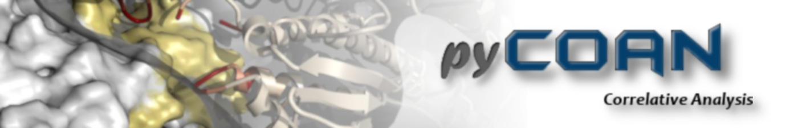

# Welcome to the pyCoAn GitHub Distribution Page

_CoAn_ stands for Correlative Analysis of electron microscopy data.  _CoAn_ was originally designed for correlation-based docking of atomic models into lower-resolution densities generated by electron microscopy and image reconstruction.  The distinguishing factor of the underlying docking methodology is the use of correlation statistics which explicitly accounts for measurement errors through cross-validation and allows the definition of confidence intervals for the rotational and translational parameters, thus defining a solution set of docked models, all of which are compatible with the data within their margin of error.

Since its inception, _CoAn_ has grown significantly in scope to incorporate analysis algorithms including denoising, segmentation, and pattern recognition. It has now evolved into a python-based design framework, _pyCoAn_, similar in concept to _Matlab_, but tailor-made for Computational Analysis of electron microscopy data.  _pyCoAn_ not only incorporates much of the functionality of the original _CoAn_ package and its extensions, it also provides seamless access to a multitude of image- and data-processing software packages with a unified interface. This allows the end-user great flexibility in data analysis and allows them to focus on the questions at hand, rather than spending time figuring out how to reformat data from package A into something package B can use.  The functionality of the _pyCoAn_ base distribution can be extended with separately distributed add-ons as well as standard Python modules. 

_pyCoAn_ is in a constant state of ongoing development, as new algorithms get incorporated and more of the original algorithms are being refactored as Python modules, along with continued work on parallelizing compute-intensive tasks. 

<h1>Installation</h1>

Currently _pyCoAn_ is only available for Linux. This binary install should work for most modern Linux distributions and contains all internal dependencies.   
First, download the base distribution tar file: <a href="https://github.com/pyCoAn/distro/releases/download/v0.3-fd5cc9d/pycoan_base_distro_0.3-fd5cc9d.tar">_pycoan_base_distro_</a>

Unpack the file with _tar -xf_, then _cd pycoan_base_install_. Follow the instructions in the _INSTALL_ file.

If you want to install add-ons, download the approriate tar files. Currently available are:  
  <a href="https://github.com/pyCoAn/distro/releases/download/v0.3-fd5cc9d/pycoan_clem_add-on_0.3-fd5cc9d.tar">_pycoan_clem_add-on_</a>: hole-based alignment of LM and EM images. 
  <a href="https://github.com/pyCoAn/distro/releases/download/v0.3-fd5cc9d/pycoan_feret_add-on_0.3-fd5cc9d.tar">_pycoan_feret_add-on_</a>: Nanodisc characterization with Feret Signatures. 
  <a href="https://github.com/pyCoAn/distro/releases/download/v0.3-fd5cc9d/pycoan_sims_add-on_0.3-fd5cc9d.tar">_pycoan_sims_add-on_</a>: Simulated tomograms of membrane embedded proteins. 

Once you unpacked all add-on tar files you want with _tar -xf, cd pycoan_add-on_install_, _cd pycoan_add-on_install_ and follow the instructions in the _INSTALL_ file

Once installed, the interactive version is called by typing _coan_ on the commandline, the batch version is called with _pycoan_

Repository at <a href="https://github.com/pyCoAn/distro/releases">_https://github.com/pyCoAn/distro/releases_</a>

<h1>Tutorials</h1>

<a href="https://htmlpreview.github.io/?https://github.com/pyCoAn/distro/blob/main/docs/MEPSi_Tutorial.html">_MEPSi_ tutorial</a> - SImulated tomograms of membrane embedded proteins 
<a href="https://htmlpreview.github.io/?https://github.com/pyCoAn/distro/blob/main/docs/Feret_Tutorial.html">_Feret Signature_ tutorial</a> - Characterization of nanodisc size distributions 
         
